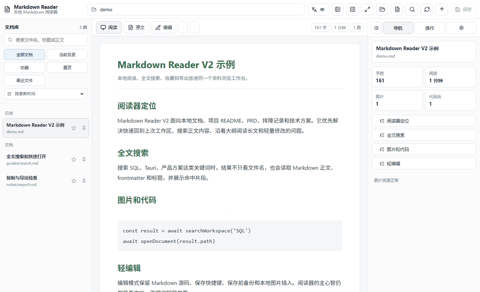

# Markdown Reader

Local-first Markdown reader and document library built with Tauri, React, and TypeScript.

Markdown Reader is for reading project documents, PRDs, README files, meeting notes, and troubleshooting records without opening an IDE. Open a folder or a single `.md` file, search filenames and body text, jump through the outline, keep reading positions, make light edits, insert local images, and export Word/PDF/reading HTML.

It is designed for people who keep serious work in Markdown but still want a calm desktop reading surface: local files stay local, the library is searchable, and export actions are one click away.

## Demo



## Why Markdown Reader

- Read large Markdown folders as a document library, not a pile of tabs.
- Search filenames, frontmatter, titles, headings, and body text from one box.
- Jump through outlines, restore the last workspace, and keep per-document scroll position.
- Keep favorites and pinned documents in app state without modifying source files.
- Make small edits, insert local images, and save with automatic backups.
- Export to Word, PDF, Markdown, plain text, or reading HTML.
- Use a strict desktop security model: sanitized Markdown rendering, a restrictive Tauri CSP, workspace-scoped file operations, and CI checks for frontend and Rust code.

## Screenshots

### Chinese UI


### English UI


## V2 Highlights

- Recent workspaces and recent files are saved locally.
- Startup can restore the last workspace, document, mode, and reading position.
- Full-text search covers filenames, titles, frontmatter, and Markdown body text.
- Search results show snippets and can open the matched document directly.
- Favorites and pinned documents are stored in app state, not in Markdown files.
- The document list supports library filters, relative paths, and sorting by updated time, filename, or path.
- Focus mode hides the library and can optionally keep the outline.
- Light editing supports unsaved-change prompts, save, save-before backup, and local image insertion.
- The right panel shows outline, document stats, image resource status, copy actions, export actions, and settings.
- Word, PDF, Markdown copy, plain-text copy, and reading HTML remain available.
- Markdown rendering is sanitized before display.
- Tauri file access is scoped to registered Markdown workspaces.
- CI covers frontend lint/build/audit and Rust fmt/clippy/test.

## Features

- Open a Markdown folder or a single Markdown file.
- Recursively scan regular Markdown directories while ignoring build folders.
- Read Markdown in a wide desktop layout with clickable outline navigation.
- Remember per-document scroll position across app restarts.
- Search body text case-insensitively.
- Mark documents as favorite or pinned without changing the source file.
- Preview local relative images and detect missing image paths.
- Click rendered images to view a larger preview.
- Edit Markdown source and save with an automatic backup in `.reader-backups/`.
- Insert local images into sibling `<document>-assets/` folders.
- Export Word `.docx` with headings, lists, code, styles, and images.
- Export PDF with bundled font support and images.
- Copy Markdown, plain text, or reading HTML.
- Save reading HTML.
- Switch the app UI between Chinese and English.

## Download

Release builds are published on GitHub Releases:

[Download the latest release](https://github.com/honestTai/tauri-markdown-reader/releases/latest)

Current build targets:

- Windows x64: `.exe` and `.msi`
- macOS Intel: `.app.tar.gz`
- macOS Apple Silicon: `.app.tar.gz`

If the macOS build is not Apple-signed or notarized, the first launch may require right-clicking the app in Finder and choosing "Open".

## Promotion Notes

Chinese launch copy and asset references are in [docs/PROMOTION.md](docs/PROMOTION.md).

## Local Development

```bash
pnpm install
pnpm run tauri:dev
```

## Local Build

```bash
pnpm run tauri:build
```

Local Windows builds require Rust/Cargo and Microsoft C++ Build Tools. Local macOS builds require Rust/Cargo, Xcode Command Line Tools, and a macOS environment.

## Release

Push a `v*` tag to create a GitHub Release:

```bash
git tag v0.2.0
git push origin main v0.2.0
```

The workflow builds Windows installers plus macOS Intel / Apple Silicon `.app` archives, then uploads them to the matching GitHub Release.

## License

This project is open-sourced under the MIT License. See [LICENSE](LICENSE).
