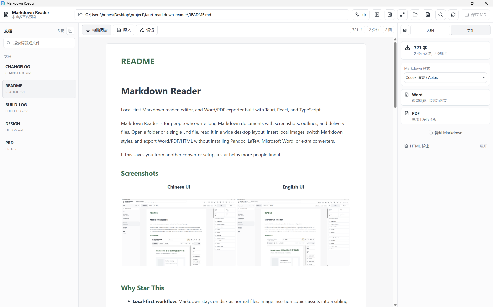
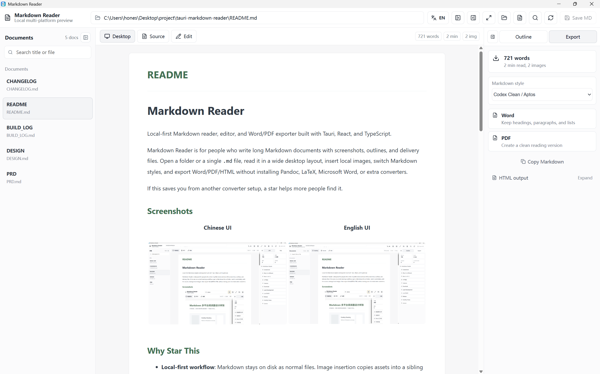

# Markdown Reader

Local-first Markdown reader, editor, and Word/PDF exporter built with Tauri, React, and TypeScript.

Markdown Reader is for people who write long Markdown documents with screenshots, outlines, and delivery files. Open a folder or a single `.md` file, read it in a wide desktop layout, insert local images, switch Markdown styles, and export Word/PDF/HTML without installing Pandoc, LaTeX, Microsoft Word, or extra converters.

If this saves you from another converter setup, a star helps more people find it.

## Screenshots

### 中文界面



### English UI



## Why Star This

- **Local-first workflow**: Markdown stays on disk as normal files. Image insertion copies assets into a sibling `<article>-assets/` folder and inserts relative Markdown paths.
- **Readable desktop layout**: left document list, center reading/editor surface, and a clickable outline on the right.
- **Bundled export path**: Word and PDF export work inside the app, including images and Chinese font support.
- **Quiet open-source UI**: Word/PDF are primary actions, HTML stays in an advanced section, and the app chrome supports Chinese / English switching.
- **Markdown styles before export**: choose from 10+ style and font presets, see the preview update, then export with the same typography.

## New In v0.1.3

- Added Chinese and English UI switching for operation buttons, panels, style labels, and common notices.
- Added README screenshots for Chinese and English UI.
- Added English names for the Markdown style presets.
- Kept Markdown content untouched when switching the app language.

## New In v0.1.2

- Added one-click outline navigation.
- Added local image insertion for Markdown editing.
- Added image support in Word and PDF exports.
- Added bundled Chinese PDF font support.
- Added automatic opening after exporting Word, PDF, and HTML files.
- Added Markdown style presets with live preview updates.
- Simplified the export panel so Word/PDF are primary and HTML is secondary.
- Removed the WeChat-width reading tab and kept the interface closer to a clean desktop reader.
- Removed fragile rich-editor loading and switched editing to a stable Markdown source editor.

## 中文摘要

Markdown Reader 是一个本地优先的 Markdown 桌面阅读、编辑和导出工具。它适合写长文、教程、产品说明或带大量截图的 Markdown 文档。

v0.1.3 新增了中英文界面切换和 README 产品截图；v0.1.2 已经支持大纲点击跳转、本地图片插入、Word/PDF 图片导出、导出后自动打开文件，以及 10 多种 Markdown 样式的实时预览。现在导出区只把 Word/PDF 作为主操作，HTML 放到高级输出里，整体更像一个简单清爽的开源桌面工具。

## Features

- Open a Markdown folder or a single Markdown file.
- Scan workflow folders such as `articles/drafts`, `articles/wemd-inbox`, and `articles/approved`.
- Read Markdown in a wide desktop layout.
- Edit Markdown source with save support.
- Insert local images into article-adjacent assets folders.
- Click outline entries to jump to headings.
- Export Word `.docx` with headings, lists, code, styles, and images.
- Export PDF with bundled font support and images.
- Copy Markdown.
- Copy or save reading HTML and WeChat-ready HTML from the advanced export section.
- Automatically open exported files after saving.
- Switch the app UI between Chinese and English.

## Download

Release builds are published on GitHub Releases:

[Download the latest release](https://github.com/honestTai/tauri-markdown-reader/releases/latest)

Current build targets:

- Windows x64: `.exe` and `.msi`
- macOS Intel: `.app.tar.gz`
- macOS Apple Silicon: `.app.tar.gz`

If the macOS build is not Apple-signed or notarized, the first launch may require right-clicking the app in Finder and choosing "Open".

## Local Development

```bash
pnpm install
pnpm run tauri:dev
```

## Local Build

```bash
pnpm run tauri:build
```

Local Windows builds require Rust/Cargo and Microsoft C++ Build Tools. Local macOS builds require Rust/Cargo, Xcode Command Line Tools, and a macOS environment.

## Release

Push a `v*` tag to create a GitHub Release:

```bash
git tag v0.1.3
git push origin main v0.1.3
```

The workflow builds Windows installers plus macOS Intel / Apple Silicon `.app` archives, then uploads them to the matching GitHub Release.

## License

This project is open-sourced under the MIT License. See [LICENSE](LICENSE).
