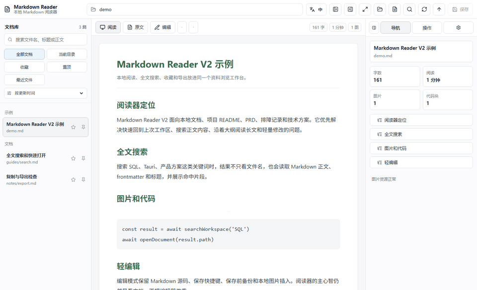
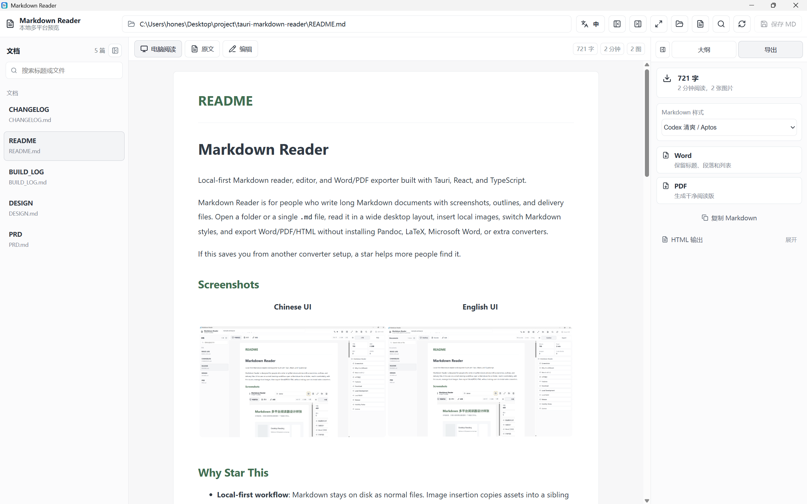
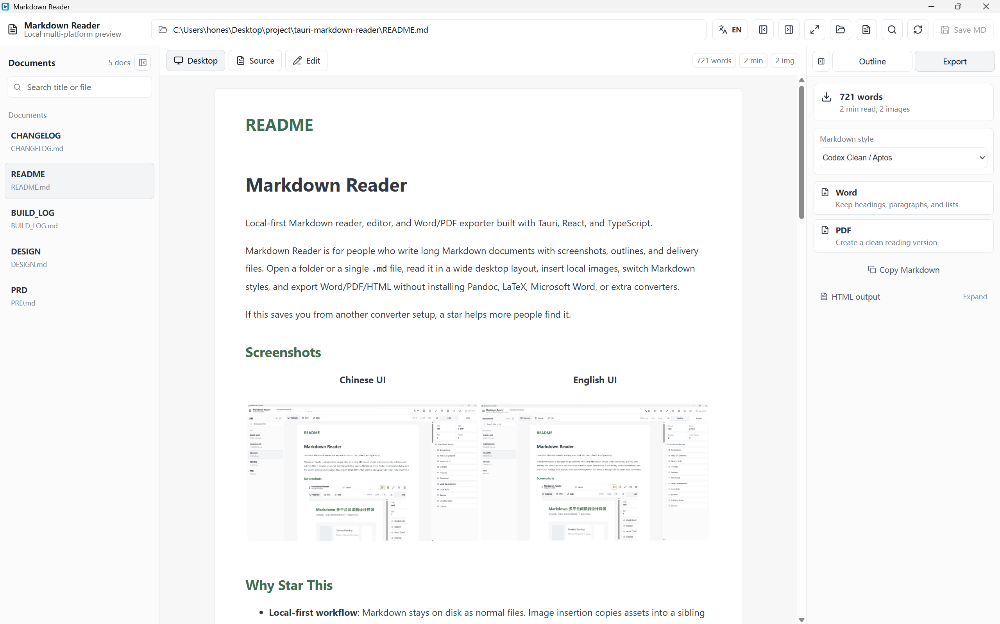

<div align="center">

# Markdown Reader

**让散落在项目里的 Markdown，成为好找、好读、好交付的文档。**  
**Make project Markdown easy to find, read, and deliver.**

[中文](README.md) · [English](README.en.md) · [下载应用 / App releases](https://github.com/honestTai/tauri-markdown-reader/releases) · [GitHub](https://github.com/honestTai/tauri-markdown-reader) · [HRouter](https://hrouter.net/home)

</div>

打开本地目录，搜索与阅读文档，进行轻量编辑，再导出 Word 或 PDF。文件留在磁盘上，工作围绕你的项目展开。

Open a local folder, search and read your docs, make light edits, and export to Word or PDF. Your files stay on disk.

**适合谁 / Who it’s for**  
经常阅读 README、技术方案、产品文档与会议笔记的开发者和团队。  
Developers and teams working with READMEs, technical plans, product docs, and meeting notes.

## 运行演示



## V3.5 重点

- 打开目录或单个 Markdown 文件，自动递归扫描常见文档目录。
- 全文搜索文件名、标题、frontmatter 和正文片段。
- 快速打开、最近文件、收藏、置顶和每篇文档滚动位置记忆。
- 修复资料库里收藏、置顶等行操作图标在部分环境下不可见的问题。
- 增加文档锁定，锁定后可读但不能误保存、插图或恢复历史。
- 增加编辑历史面板，可预览和恢复保存前备份。
- 阅读、编辑两种主视图；编辑模式就是 Markdown 源码视图，保存前自动备份。
- 编辑器支持选区快捷键，可快速插入加粗、链接、公式、表格、代码块和 Mermaid 图表。
- 技术文档增强渲染：代码高亮、代码复制、KaTeX 公式、Mermaid 图表、GFM 表格和 GitHub 风格 callout。
- 帮助窗口内置 Markdown 指南，点击即可在阅读区打开完整使用手册。
- 本地图片插入、截图粘贴、图片拖入和缺失图片检查。
- PDF 转 Markdown 草稿，适合可复制文本 PDF。
- DOCX 转 Markdown 草稿，尽量保留标题、列表、表格和图片。
- 拖入文件夹、Markdown、PDF、DOCX 或图片时按类型自动处理。
- 导出 Word、PDF、阅读 HTML，也支持复制 Markdown、纯文本和 HTML。
- GUI 安装包内置 `md-reader` CLI（Windows 为 `md-reader.exe`），可被系统终端、Codex 或其他 Agent 调用。
- 中英文界面切换。
- DOMPurify Markdown 净化、严格 CSP 和工作区文件范围限制。

V3 不再保留内置终端。真实终端在 Tauri WebView2/xterm 渲染链上不够稳定，后续 Agent/V4 会优先走外部 CLI。

## 截图

### 中文界面



### 英文界面



## 适合场景

- 不打开 IDE，快速阅读项目 README、PRD、技术方案和版本说明。
- 在交付目录里搜索会议记录、排障记录、复盘文档和客户资料。
- 把本地 Markdown 知识库整理成可检索、可收藏、可导出的资料库。
- 阅读带代码、公式、表格和 Mermaid 图表的技术文档。
- 用快捷键快速整理 Markdown 结构，例如公式、表格、代码块、任务列表和图表。
- 把 PDF 或 DOCX 先转成 Markdown 草稿，再继续编辑。
- 把 Markdown 内容交付为 Word、PDF 或阅读 HTML。
- 让 Codex、Claude Code 等工具用 CLI 读取、转换和搜索本地文档。

## 下载

发布包上传到 GitHub Releases：

[下载最新版本](https://github.com/honestTai/tauri-markdown-reader/releases/latest)

当前构建目标：

- Windows x64：NSIS `.exe` 安装包和 `.msi`
- macOS Apple Silicon / M 系列：`.app.tar.gz`

macOS 只发布 Apple Silicon / M 系列版本，不再支持 Intel 版安装包。如果 macOS 构建未经过 Apple 签名或公证，首次启动时可能需要在 Finder 中右键应用并选择“打开”。

## CLI

GUI 安装包会一起放入 `md-reader` CLI（Windows 为 `md-reader.exe`）。也可以在本地构建后直接调用：

```bash
cargo build --manifest-path src-tauri/Cargo.toml --release --bin md-reader
src-tauri/target/release/md-reader list ./docs --json
src-tauri/target/release/md-reader import input.docx --to md --out ./output --json
src-tauri/target/release/md-reader convert input.docx --to md --out ./output --json
src-tauri/target/release/md-reader export ./docs/example.md --to html --out ./exports --json
src-tauri/target/release/md-reader export ./docs/example.md --to txt --out ./exports --json
src-tauri/target/release/md-reader inspect input.pdf --json
src-tauri/target/release/md-reader search ./docs --query "关键词" --json
src-tauri/target/release/md-reader read ./docs/example.md --json
src-tauri/target/release/md-reader save ./docs/example.md --in ./draft.md --json
src-tauri/target/release/md-reader history ./docs/example.md --json
src-tauri/target/release/md-reader history-read ./docs/example.md --history ./docs/.reader-backups/example-xxx.md --json
src-tauri/target/release/md-reader restore ./docs/example.md --history ./docs/.reader-backups/example-xxx.md --json
```

DOCX 转换会把图片输出到 Markdown 同名 `.assets` 目录，方便后续继续编辑或交给本地 Agent 处理。CLI 导出支持 `md`、`txt`、`html`；Word/PDF 富导出仍在 GUI 中完成。`save`、`history`、`restore` 复用 GUI 的保存前版本目录，写入或恢复前会先备份当前内容。

## 本地开发

```bash
pnpm install
pnpm run tauri:dev
```

## 本地构建

```bash
pnpm run tauri:build
```

Windows 本地构建需要 Rust/Cargo 和 Microsoft C++ Build Tools。macOS 本地构建需要 Rust/Cargo、Xcode Command Line Tools 和 macOS 环境。

## 发布

推送 `v*` tag 会创建 GitHub Release：

```bash
git tag v3.5
git push origin main v3.5
```

工作流会构建 Windows 安装包和 macOS Apple Silicon / M 系列 `.app` 归档，并上传到对应 Release。当前 Windows 本地包也会手动上传到 Release assets。

## 宣传素材

中文宣传文案和素材路径见 [docs/PROMOTION.md](docs/PROMOTION.md)。

## License

本项目基于 MIT License 开源，详见 [LICENSE](LICENSE)。

## 作者与 HRouter · About the author

我是 **honestTai**，开发工具，也运营 [HRouter](https://hrouter.net/home)。这里持续分享实用代码、AI 应用、Skills 与插件，把工作中的需求变成可复用的项目。  
I’m **honestTai**, the developer and operator behind HRouter. I share practical code, AI apps, skills, and plugins built around real workflows.

本项目本身无需接入 HRouter。如果你也使用 AI 编程工具，欢迎了解我运营的 HRouter 模型路由服务。  
This project does not require HRouter. If you also work with AI coding tools, explore my HRouter model-routing service.

[了解 HRouter · Explore HRouter](https://hrouter.net/home) · [发现更多项目 · More projects](https://github.com/honestTai)

**觉得有用，欢迎 Star；有想法，欢迎到 Issues 交流。**  
**Star the project if it helps, and share your ideas in Issues.**
