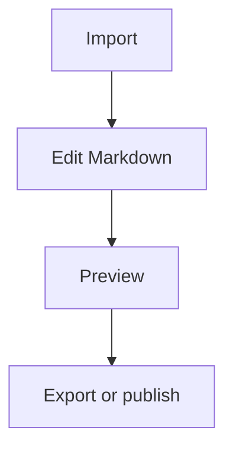

# Markdown Reader Guide

Markdown Reader is a local Markdown reading and editing tool. It is useful for article drafts, technical notes, imported PDF/DOCX drafts, and Markdown files that you want to continue processing with a local agent or CLI.

## Recommended Workflow

1. Open a Markdown workspace with the folder button.
2. Use Read mode to inspect structure, math, code blocks, diagrams, and images.
3. Switch to Edit mode to modify the Markdown source.
4. Save changes. The app creates a pre-save version before writing.
5. Use the Actions panel to export Word, PDF, reading HTML, Markdown, plain text, or HTML.

## Global Shortcuts

| Shortcut | Action |
| --- | --- |
| Ctrl/Cmd+O | Open Markdown file |
| Ctrl/Cmd+Shift+O | Open folder |
| Ctrl/Cmd+S | Save current file |
| Ctrl/Cmd+K | Quick open |
| Ctrl/Cmd+F | Focus search |
| Ctrl/Cmd+1 | Read mode |
| Ctrl/Cmd+2 | Edit mode |
| Ctrl/Cmd+. | Focus mode |
| Esc | Collapse menus, floating panels, dialogs, image preview, and history panel |

## Editor Selection Shortcuts

When text is selected in the editor, shortcuts wrap the selection. Without a selection, they insert a placeholder template.

| Shortcut | Action | Example |
| --- | --- | --- |
| Ctrl/Cmd+B | Bold | `**text**` |
| Ctrl/Cmd+I | Italic | `_text_` |
| Ctrl/Cmd+` | Inline code | `` `code` `` |
| Ctrl/Cmd+K | Link | `[text](https://)` |
| Ctrl/Cmd+Shift+M | Inline math | `$x^2 + y^2 = z^2$` |
| Ctrl/Cmd+Alt+M | Block math | `$$ ... $$` |
| Ctrl/Cmd+Shift+T | Table | Markdown table |
| Ctrl/Cmd+Shift+C | Code block | fenced code block |
| Ctrl/Cmd+Shift+G | Mermaid diagram | ` ```mermaid ` |
| Ctrl/Cmd+Shift+Q | Quote | `> quote` |
| Ctrl/Cmd+Shift+L | List | `- item` |
| Ctrl/Cmd+Shift+X | Task list | `- [ ] task` |

## Math

Inline math:

`$E = mc^2$`

Block math:

```md
$$
\int_0^1 x^2 dx = \frac{1}{3}
$$
```

## Code Highlighting

Add a language tag to code blocks for better highlighting:

```ts
type Article = {
  title: string
  content: string
}
```

```python
def hello(name: str) -> str:
    return f"hello {name}"
```

## Tables

```md
| Name | Description |
| --- | --- |
| Markdown | Good for structured writing |
| Mermaid | Good for flowcharts and relationships |
```

## Mermaid Diagrams



## Images

Edit mode supports three image paths:

1. Use the image button to choose a local image.
2. Press Ctrl/Cmd+V in the editor to paste a screenshot or clipboard image.
3. Drop an image file into the window. The app saves it into the current article assets and inserts Markdown image syntax.

## Edit History

Before each save, the app backs up the current file into `.reader-backups`. When restoring a previous version, the app backs up current content first and then overwrites the active file.

## CLI

The GUI installer also ships the `md-reader` CLI. Common commands:

```powershell
md-reader list <workspace> --json
md-reader read <article.md> --json
md-reader search <workspace> --query "keyword" --json
md-reader export <article.md> --to html --out <dir> --json
md-reader save <article.md> --content "# New" --json
md-reader history <article.md> --json
md-reader restore <article.md> --history <backup.md> --json
```

CLI export supports `md`, `txt`, and `html`. Rich Word/PDF export remains in the GUI.

## Known Limits

- Scanned PDFs are not OCRed automatically.
- DOCX text boxes, complex pagination, headers, footers, and complex formulas may not round-trip fully.
- Markdown preserves editable structure; it does not reproduce Word layout one-to-one.
