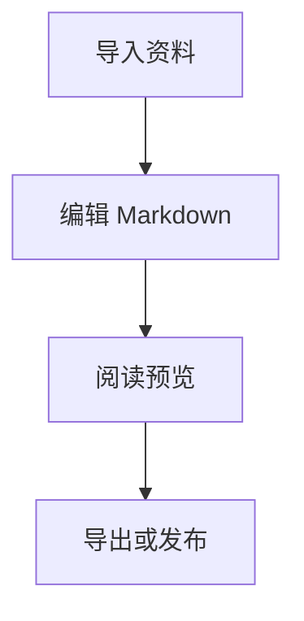

# Markdown Reader 使用指南

Markdown Reader 是一个本地 Markdown 阅读和编辑工具。它适合整理文章草稿、公众号素材、技术笔记、导入的 PDF/DOCX 草稿，以及需要给本地 Agent 或 CLI 继续处理的 Markdown 文件。

## 推荐工作流

1. 用“选择目录”打开一个 Markdown 工作区。
2. 在“阅读”模式检查结构、公式、代码块、图表和图片。
3. 切到“编辑”模式修改 Markdown 源文。
4. 保存时应用会先生成保存前版本，之后可以从“编辑历史”恢复。
5. 用右侧“操作”导出 Word、PDF、阅读 HTML，或复制 Markdown、纯文本、HTML。

## 全局快捷键

| 快捷键 | 功能 |
| --- | --- |
| Ctrl/Cmd+O | 打开 Markdown 文件 |
| Ctrl/Cmd+Shift+O | 打开目录 |
| Ctrl/Cmd+S | 保存当前文件 |
| Ctrl/Cmd+K | 快速打开 |
| Ctrl/Cmd+F | 聚焦搜索 |
| Ctrl/Cmd+1 | 阅读模式 |
| Ctrl/Cmd+2 | 编辑模式 |
| Ctrl/Cmd+. | 专注模式 |
| Esc | 收起菜单、浮层、弹窗、图片预览、历史面板 |

## 编辑选区快捷键

在编辑器里选中文本后，可以直接使用快捷键包裹语法；没有选中文本时，会插入占位模板。

| 快捷键 | 功能 | 示例 |
| --- | --- | --- |
| Ctrl/Cmd+B | 加粗 | `**文本**` |
| Ctrl/Cmd+I | 斜体 | `_文本_` |
| Ctrl/Cmd+` | 行内代码 | `` `code` `` |
| Ctrl/Cmd+K | 链接 | `[文本](https://)` |
| Ctrl/Cmd+Shift+M | 行内公式 | `$x^2 + y^2 = z^2$` |
| Ctrl/Cmd+Alt+M | 块公式 | `$$ ... $$` |
| Ctrl/Cmd+Shift+T | 表格 | Markdown 表格 |
| Ctrl/Cmd+Shift+C | 代码块 | fenced code block |
| Ctrl/Cmd+Shift+G | Mermaid 图表 | ` ```mermaid ` |
| Ctrl/Cmd+Shift+Q | 引用 | `> 引用内容` |
| Ctrl/Cmd+Shift+L | 列表 | `- 列表项` |
| Ctrl/Cmd+Shift+X | 任务列表 | `- [ ] 待办` |

## 公式

行内公式：

`$E = mc^2$`

块公式：

```md
$$
\int_0^1 x^2 dx = \frac{1}{3}
$$
```

## 代码高亮

给代码块加语言标记可以获得更好的高亮效果：

```ts
type Article = {
  title: string
  content: string
}
```

```python
def hello(name: str) -> str:
    return f"hello {name}"
```

## 表格

```md
| 名称 | 说明 |
| --- | --- |
| Markdown | 适合结构化写作 |
| Mermaid | 适合流程图和关系图 |
```

## Mermaid 图表



## 图片

编辑模式支持三种图片入口：

1. 点击图片按钮选择本地图片。
2. 在编辑器里 Ctrl/Cmd+V 粘贴截图或剪贴板图片。
3. 拖入图片文件，应用会保存到当前文章资源目录并插入 Markdown 图片语法。

## 编辑历史

每次保存前，应用会把当前文件备份到 `.reader-backups` 目录。恢复历史版本时，应用会先备份当前内容，再覆盖当前文件，避免误恢复后丢失最新内容。

## CLI

安装 GUI 后会随应用安装 `md-reader` CLI。常用命令：

```powershell
md-reader list <workspace> --json
md-reader read <article.md> --json
md-reader search <workspace> --query "关键词" --json
md-reader export <article.md> --to html --out <dir> --json
md-reader save <article.md> --content "# New" --json
md-reader history <article.md> --json
md-reader restore <article.md> --history <backup.md> --json
```

CLI 导出支持 `md`、`txt`、`html`。Word/PDF 富导出仍在 GUI 中完成。

## 常见限制

- 扫描件 PDF 暂不自动 OCR。
- DOCX 文本框、复杂分页、页眉页脚、复杂公式可能无法完整还原。
- Markdown 适合保存内容结构，不适合一比一复刻 Word 版式。
